# **e-Health Device on STM32F429 Discovery Kit**

# **Table of Content**

- [**e-Health Device on STM32F429 Discovery Kit**](#e-health-device-on-stm32f429-discovery-kit)
- [**Table of Content**](#table-of-content)
- [**Introduction**](#introduction)
- [**Development Environment**](#development-environment)
- [**Final Result**](#final-result)
- [**Features**](#features)
- [**To Do**](#to-do)
- [**File Structures**](#file-structures)
- [**General Architecture**](#general-architecture)
- [**Requirements**](#requirements)
  - [**Hardware**](#hardware)
    - [**Circuit Design**](#circuit-design)
    - [**Choice of Hardware**](#choice-of-hardware)
    - [**Bill of Materials**](#bill-of-materials)
    - [**Debugging materials**](#debugging-materials)
  - [**Software**](#software)
    - [**Graphics software for STM32**](#graphics-software-for-stm32)
    - [**Development methods with TouchGFX**](#development-methods-with-touchgfx)
    - [**Importing TouchGFX project into STM32CubeIDE**](#importing-touchgfx-project-into-stm32cubeide)
    - [**Interfacing Hardware and GUI**](#interfacing-hardware-and-gui)
- [**Useful Links**](#useful-links)

# **Introduction**

I did this project during my 2nd year engineering internship at ENSIAS school in Morocco. It was a team work with my partner Mohamed El Hlafi.

The prototype need offer to users an intuitive, easy-to-use graphical interface, the display of data provided by the various health indicators sensors connected to our system and finally should allow remote communication with a doctor even the booking of an appointment using a user account and a Wi-Fi connection.

All these functionalities will aim to reduce users' travel to hospitals and allow them to be up to date with their health status.

Our main task was the design and implementation of the GUI on the STM32F429 Discovery Kit board which incorporates a touch screen LCD.

# **Development Environment**

- **IDE :** STM32CubeIDE 1.7.0
- **GUI Framework :** TouchGFX 4.17.0
- **Toolchain :** arm-none-eabi, GNU Arm Embedded Toolchain 9-2020-q2-update
- **Packages :** STM32Cube MCU Package for STM32F4 Series 1.26.2, TouchGFX Generator 4.17.0
- **OS :** Windows 10

# **Final Result**

| Startup_Screen              | HomeMenu_Screen              |
| --------------------------- | ---------------------------- |
| 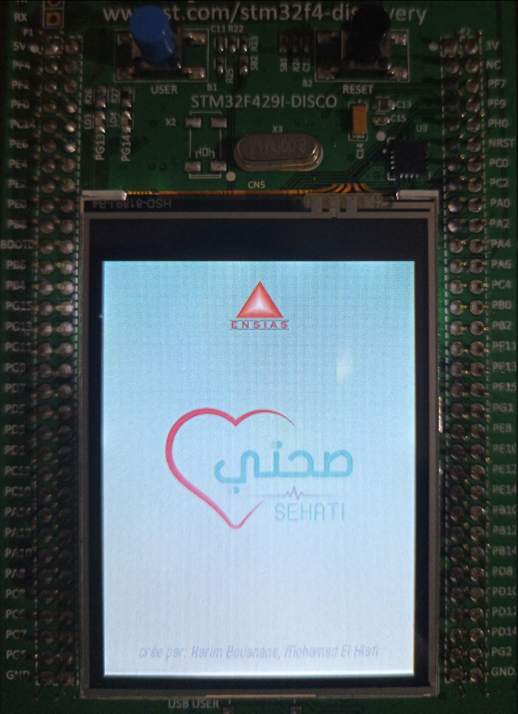 | 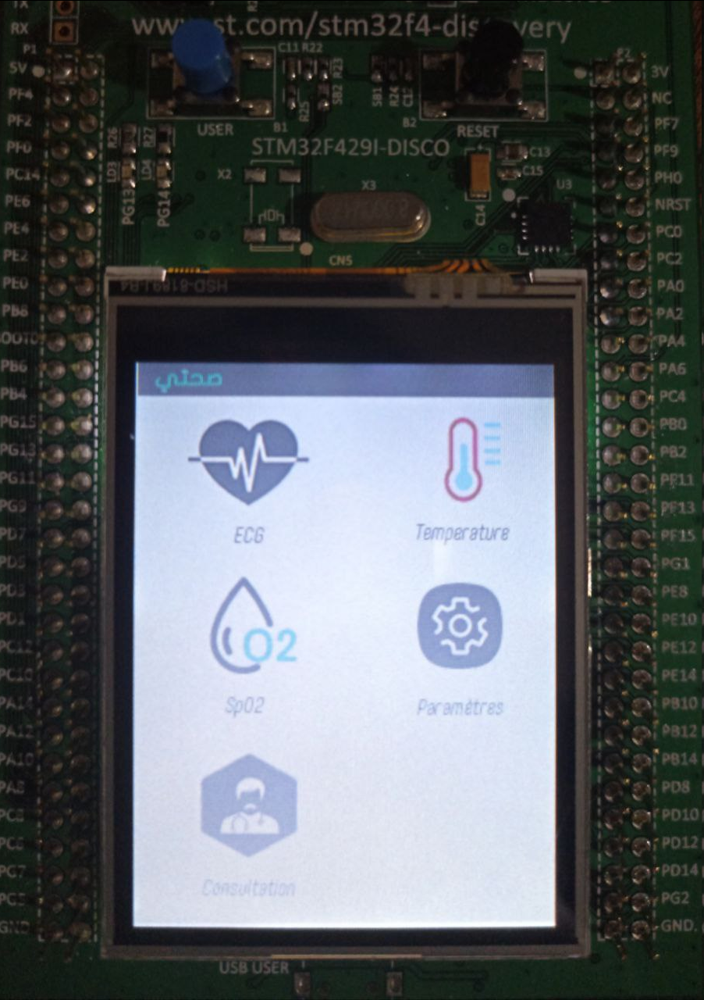 |

| ECG_Screen              | Temperature_Screen              |
| ----------------------- | ------------------------------- |
| 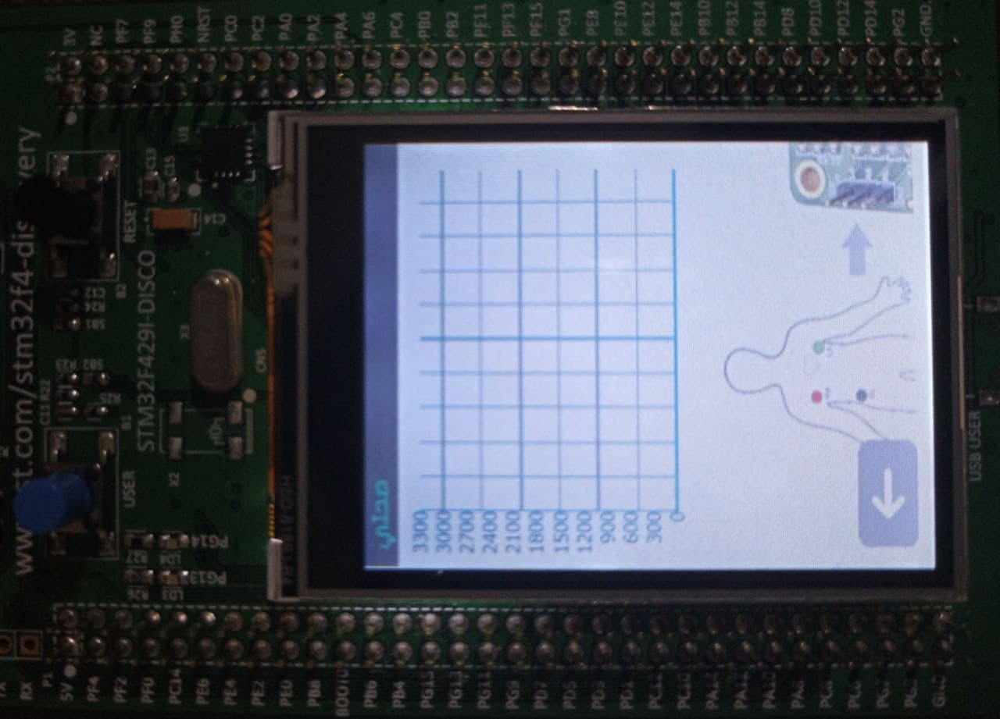 | 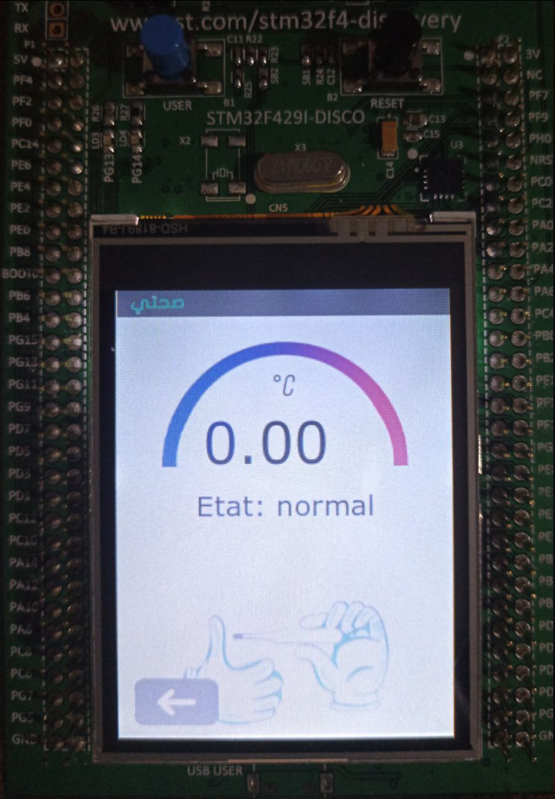 |

| SPO2_Screen              | Consultation_Screen              |
| ------------------------ | -------------------------------- |
| 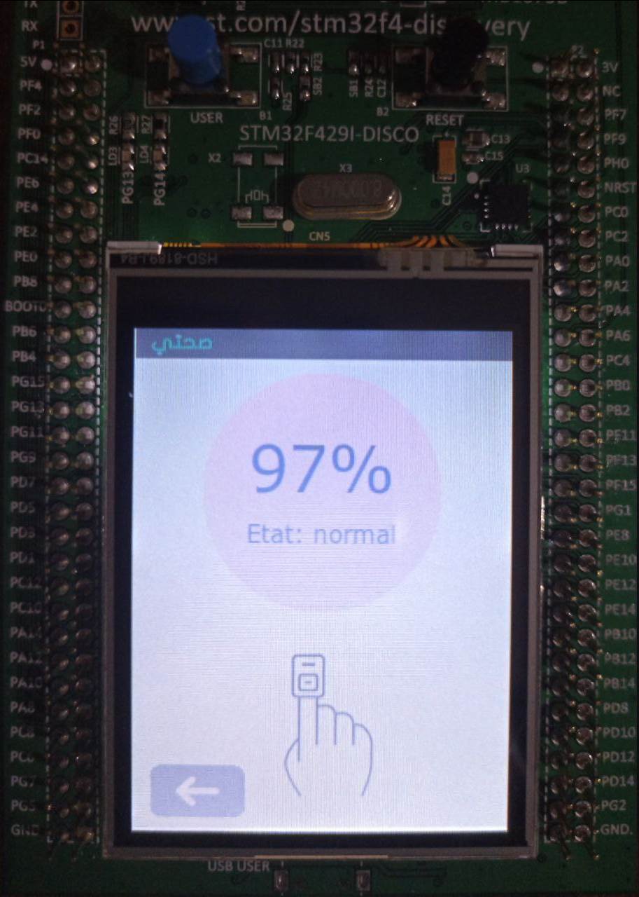 | 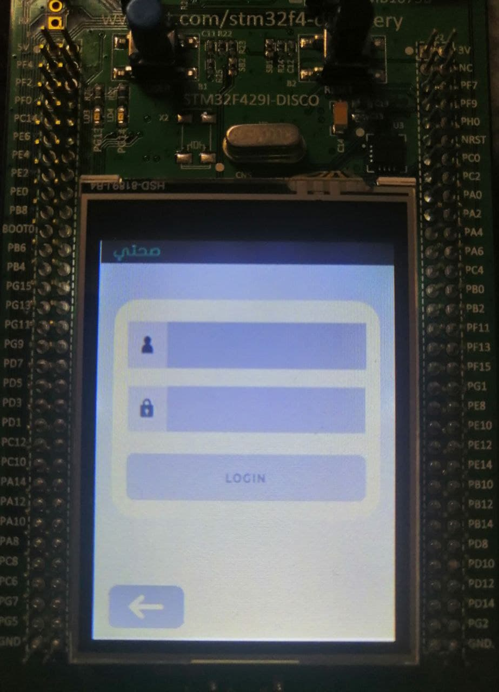 |

**Memory Usage**

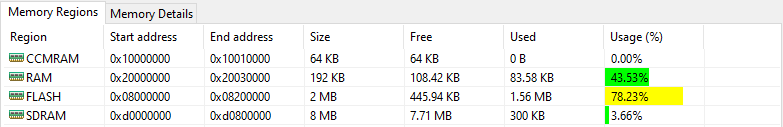

**Video Demonstration**


# **Features**

- Display data of temperature from LM35 sensor
- Display data of Electrocardiodiagram graph from AD8232 circuit
- Search for available networks using ESP8266-01
- Login interface

# **To Do**

- [ ] Complete the button connecting and disconnecting from a WiFi SSID
- [ ] Complete the backend of the login screen

# **File Structures**

I just put the important files, the others can be generated with the TouchGFX Designer. You need to choose the template for the STM32F429 discovery kit board then generate code and replace your files with those above.

```c
├── ESP-01 Code     // WiFi Module
|   └── .ino        // API code
|
├── Core            // main entry
│   ├── Inc         // header files
│   └── Src         // main.c
│
├── TouchGFX        // GUI
│   ├── assets      // fonts, images, texts
│   ├── generated   // auto-generated, do not modify
│   ├── gui         // mvp classes for screens
│   └── e-Health-Device.touchgfx  // touchGFX project file
│
├── STM32CubeIDE    // GUI
|   └── .project    // stm32cubeIDE project file
|
└── STM32F429I-DISCO.ioc   // CubeMX project file
```

# **General Architecture**

In the folling schema, the vital parameters we have chosen such as temperature, heart rate, SpO2, ECG are monitored using the STM32F429 microcontroller. Each sensor has its own conditioning circuit that amplifies and clarifies the signals, we just need to interface them and read the data. The data will be displayed on the TFT LCD touch screen which is integrated in the same board as the microcontroller also it can be monitored remotely through a web application. For this, the ESP01 WiFi module is used to allow scanning of nearby wifi's and connecting to one of them.

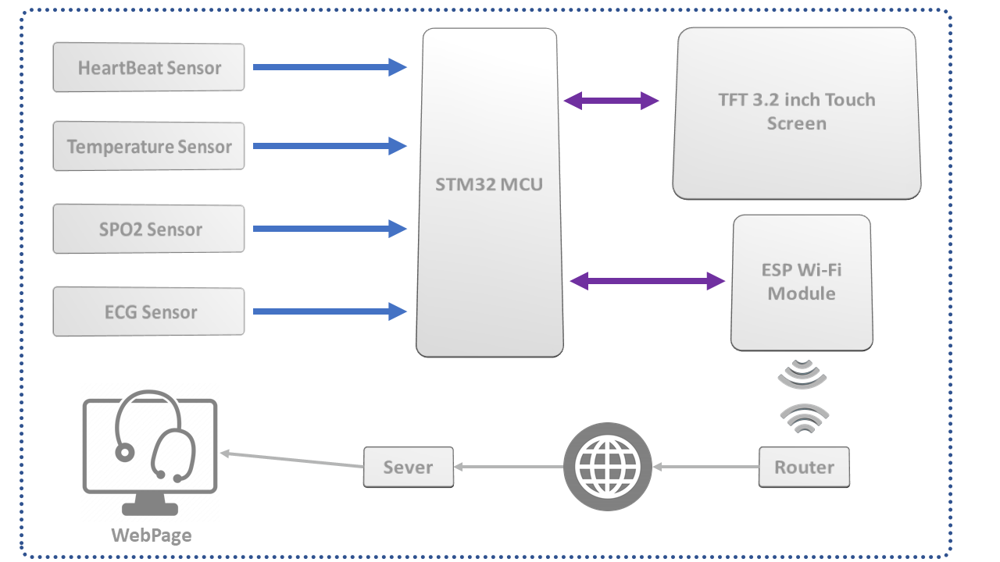

# **Requirements**

## **Hardware**

### **Circuit Design**

The image below shows how wiring between different parts of system was done:

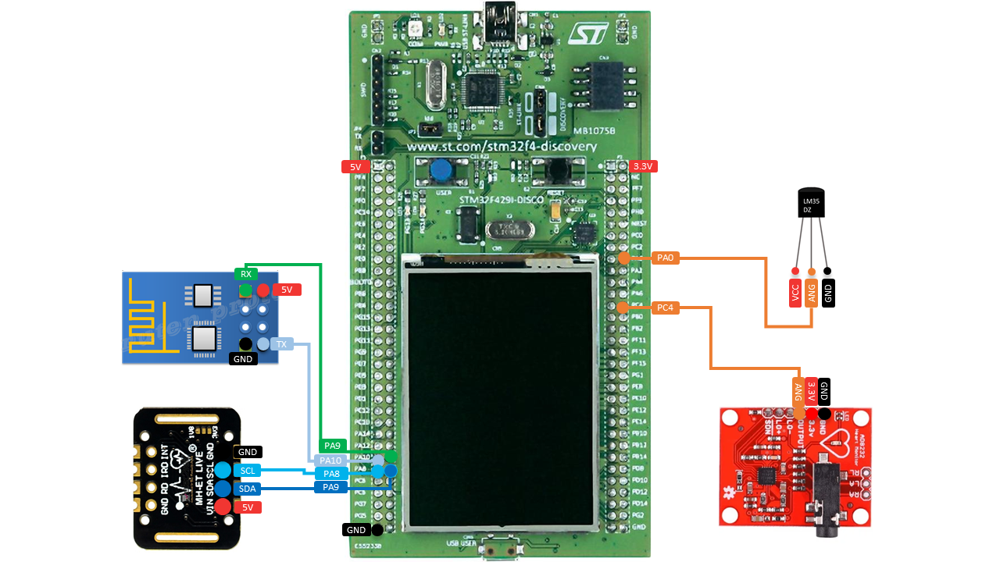

**LM35 (temperature sensor)** and **AD8232 (ECG sensor)** require only single wire bus communication and no external components for calibration or adjustment to provide accurate measurement. They are analogue devices powered by 3.3V, they have an output pin which must be connected to an ADC channel of the STM32 to read the analogue signals.

- The **[ESP01](https://www.microchip.ua/wireless/esp01.pdf) (WiFi Module)** board is interfaced using the UART protocol which requires only 2 wires (RX, TX). The board does not tolerate 5V and must be powered by 3.3V.
- **MAX30102 (SPO2 sensor)** is a module that uses the I²C serial protocol which requires also 2 wires (SDA, SCL). The module can be powered from 3V to 5V.

### **Choice of Hardware**

The choice of sensors was based on their price and their availability on the aliexpress platform. I just needed to interface them and collect their data to be able to display them as text or graphs.

The **[STM32F429](https://www.st.com/en/microcontrollers-microprocessors/stm32f429zi.html) Discovery board** microcontroller is chosen for its high performance, its integration of all the needed peripherals and also because the TouchGFX designer software which we are using allows the generation of GUI code as well as the direct programming of discovery kit boards.

The **ESP01** is the smallest and cheapest WiFi module we found and it can be programmed using Arduino IDE. We used it to create an API that has three functions: scanning for available wifis in the area, connecting to an SSID, disconnecting from an SSID.

### **Bill of Materials**

All materiels discussed were bought from AliExpress and here is the bill:

| Material                | Price |
| ----------------------- | ----- |
| STM32F429 Discovery Kit | 52$   |
| ECG Module AD8232       | 4$    |
| LM35 Temperature Sensor | 1$    |
| ESP01 WiFi Module       | 1$    |
| MAX30102 SPO2 sensor    | 2$    |
| **Total**               | 60$   |

### **Debugging materials**

I used materials like:

[USB Analyzer](https://a.aliexpress.com/_mqt8Z6L) helped me visualize the low-level details of the signals used in the communication protocols and saves me a lot of time in debugging.

I also used [FTDI chip](https://a.aliexpress.com/_m0YMKaJ) that convert USB protocol to UART protocol to test the **ESP01 API** since it uses UART interface to communicate with the STM32.

## **Software**

### **Graphics software for STM32**

There are three popular GUI software for embedded systems. They are presented in the figure below:

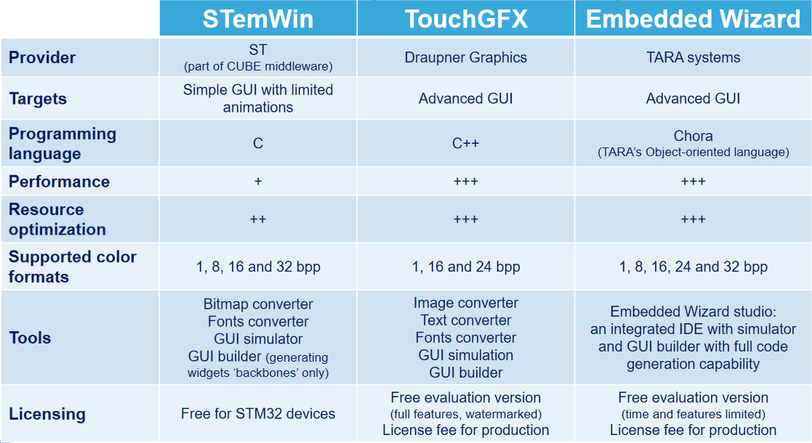

We chose **TouchGFX** since it is optimized for the **STM32** microcontrollers and targets advanced applications with animations. It offers a very intuitive desktop application (**TouchGFX Designer**) that allows you to create GUI interfaces with the drag and drop technique, and generate code for the targeted board. Also, it offers an extension (**TouchGFX Generator**) on the STM32CubeIDE, which allows the configuration of differents parameters that manage the operation of the GUI application on the microcontroller like the size of buffer memory, enabling the accelerator Chrom-ART ....

To conclude, **TouchGFX package** has a fast learning curve since it offers drag and drop tool to create GUI applications, easy to configure application ressources management parameters, use of C++ language and finally a very good documentation.

### **Development methods with TouchGFX**

These are the tools in the **TouchGFX package**. **TouchGFX Generator** is installed as a plugin in the **STM32CubeIDE** and **TouchGFX Designer** is installed as desktop application. **TouchGFX engine** is the one that runs in the microcontroller to manage the GUI application.

<p align="center">
  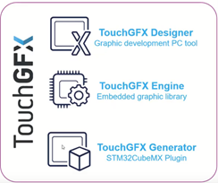
</p>

There is two ways to develop application using TouchGFX as shown in the following images:

| Method 1                                     | Method 2                                     |
| -------------------------------------------- | -------------------------------------------- |
| 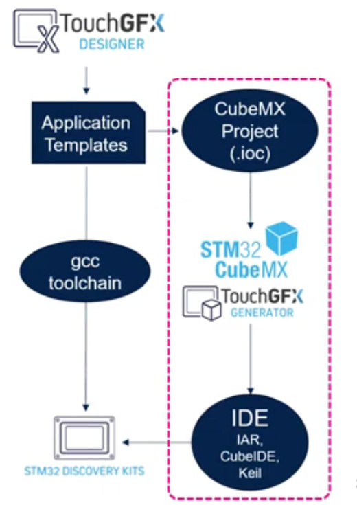 | 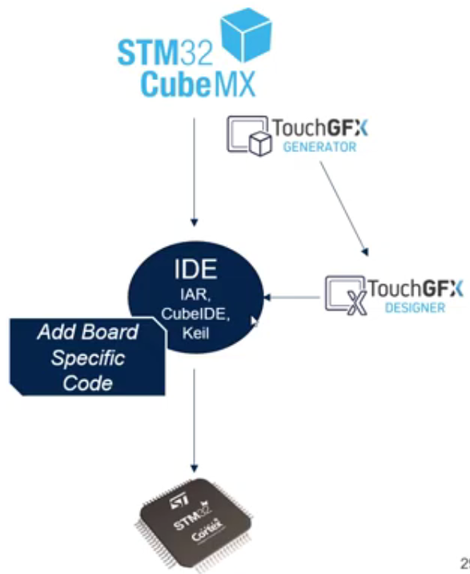 |

**Method 1:**

**TouchGFX Designer** offers templates for all development kit boards. After choosing the one for the **STM32F429Disco** board, we develop the interfaces of our application, then we generate the code and modify the generated project with the **STM32CubeIDE** to reconfigure (optional) some parameters of the GUI application resources management and also to add the hardware interfacing with the GUI.

**Method 2:**

In this method you start by creating a new project on **STM32CubeIDE**, configure the parameters of GUI application with the **TouchGFX Generator** plugin, generate the project code then you modify the ".touchgfx" file to include graphic interfaces. The main problem with this method is it doesn't generate the needed drivers like the one for the screen in the board. So after adding the drivers, you need to manage the link between them, the GUI application and the RTOS. All this tasks represents a lot of work which is made simple by the **TouchGFX Designer**. However, this method is used for custom board.

### **Importing TouchGFX project into STM32CubeIDE**

Watch this youtube video: https://www.youtube.com/watch?v=Q-mfuzW6S-0

If you don't see the .ioc file in the project explorer, you can drag it from your project root folder and drop it there. When the window of File Operation appear, select Link to files then click OK.

### **Interfacing Hardware and GUI**

Watch the following video, it explains clearly the procedure I used to read data from sensors and display them into a specific screen: [ Into to MVP (Model View Presenter)](https://www.youtube.com/watch?v=4iJaGpk1pJk)

For more info on the Model-View-Presenter Design Pattern please refer to this section of the documentation: [TouchGFX MVP](https://support.touchgfx.com/4.18/docs/development/ui-development/software-architecture/model-view-presenter-design-pattern).

# **Useful Links**

TouchGFX Documentation

- https://support.touchgfx.com/4.18/docs/introduction/welcome

Youtube playlist: STM32 Graphics workshop with TouchGFX Lab

- https://www.youtube.com/playlist?list=PLnMKNibPkDnEeRXg7w6DLVDfrovQJ3KAI

Good slides with usefull informations:

- https://www.st.com/content/dam/technology-tour-2018/chicago/post/T1_S3_EmbeddedGraphics_TT_Schaumburg.pdf
